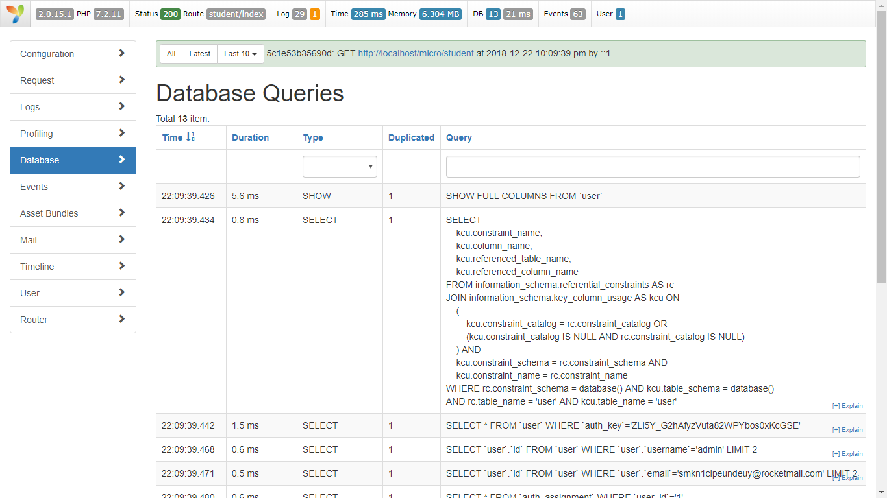

# yii2-micro-api
yii2 micro for rest api
Using Yii as a Micro-framework
Yii can be easily used without the features included in basic and advanced templates. 
In other words, Yii is already a micro-framework. It is not required to have the directory structure provided by templates to work with Yii. 

download then run composer update 

yii2-micro-api does not create database for you, you have to create yourself 

this template already include register user and login

http://localhost/yii2-micro-api/site/login - login - post  
http://localhost/yii2-micro-api/site/register - register - post

this template also include debug toolbar and gii 

you can acces gii using http://localhost/yii2-micro-api/gii  
you can acces debug using http://localhost/yii2-micro-api/debug

